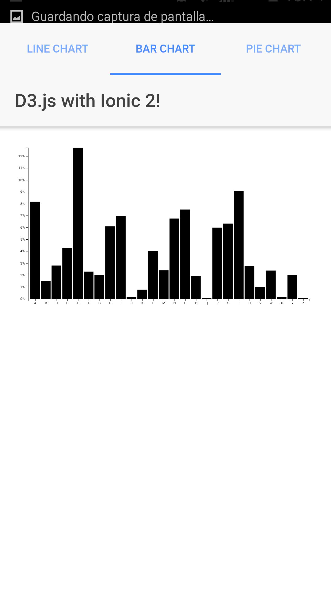
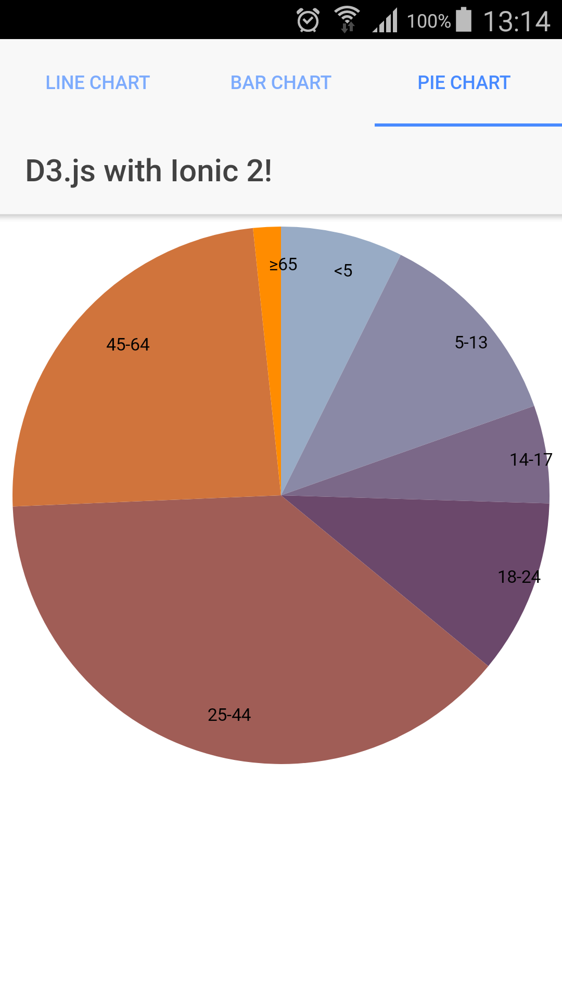

# D3.js with Ionic 2 Examples

This project shows how to integrate D3.js with Ionic 2.

We'll implement a few D3.js examples described in [bl.ocks.org](https://bl.ocks.org/) in Angular2.

##  Examples Summary

 * Line Chart
 * Bar Chart
 * Pie Chart

## Configuration

Before you go through this example, you should have at least a basic understanding of Ionic 2 concepts. You must also already have Ionic 2, Node.js and npm installed on your machine.

1. Install D3.js

```bash
	npm install d3 --save
	npm install @types/d3 --save-dev --save-exact
```
	
2. Run Ionic App

	* Test in localhost: 
	
	```bash
		ionic serve
	```

	* Test in Android/iOS mobile: 
	
		```bash
    		ionic add platform android 
    		ionic add platform ios
    		ionic run android
    		ionic run ios
    	```

	
	
	
	
## Ionic 3.5

To test in Ionic 3.5 it is necessary to make the following modifications:

    ionic2-super-tabs ERROR: 
    
    https://github.com/zyra/ionic2-super-tabs/ README
    
    "Due to the way this module is designed, some versions of the module might not work with all versios of the Ionic Framework. Refer to the following table to use the appropriate version. Also, some features in the later versions might not be available in the older versions of this module. This page only contains the latest documentation. For older documentation, look up the previous versions of the README.md file using Github.
    
    Ionic Framework Version ionic2-super-tabs version
    3.5.x 3.0.0
    3.4.x 2.6.3
    3.0.0 3.3.x
    2.0.0 2.6.3
    2.x.x 1.x.x "

	1. Update ionic2-super-tabs dependency in package.json
	
		```bash
    		"ionic2-super-tabs": "3.0.0"
    	```
    2. Modify tabs.html 
    
        ```bash
        <super-tabs id="mainTabs" selectedTabIndex="0" toolbarColor="light" toolbarBackground="dark" indicatorColor="light"
                        badgeColor="light" [config]="{ sideMenu: 'left' }" (tabSelect)="onTabSelect($event)">
        ```
    3. Modify tabs.ts.
    
        ```bash
        import { Component } from '@angular/core';
        
        import { BarChartPage } from '../bar-chart/bar-chart';
        import { PieChartPage } from '../pie-chart/pie-chart';
        import { LineChartPage } from '../line-chart/line-chart';
        
        import { SuperTabsController } from 'ionic2-super-tabs';
        
        @Component({
          templateUrl: 'home.html',
          providers: [SuperTabsController]
        })
        export class HomePage {
        
          tab1Root: any = LineChartPage;
          tab2Root: any = BarChartPage;
          tab3Root: any = PieChartPage;
        
          constructor(private superTabsCtrl: SuperTabsController) {
        
          }
        
          /*
          ngAfterViewInit() {
        
            // must wait for AfterViewInit if you want to modify the tabs instantly
            this.superTabsCtrl.setBadge('firstPage', 5);
        
          }
          */
        
          hideToolbar() {
            this.superTabsCtrl.showToolbar(false);
          }
        
          showToolbar() {
            this.superTabsCtrl.showToolbar(true);
          }
        
          onTabSelect(ev: any) {
          console.log('Tab selected', 'Index: ' + ev.index, 'Unique ID: ' + ev.id);
            }
          
          }
          ```
     

## License
MIT License.

Original work Copyright (c) 2017 Adrián Brito  


